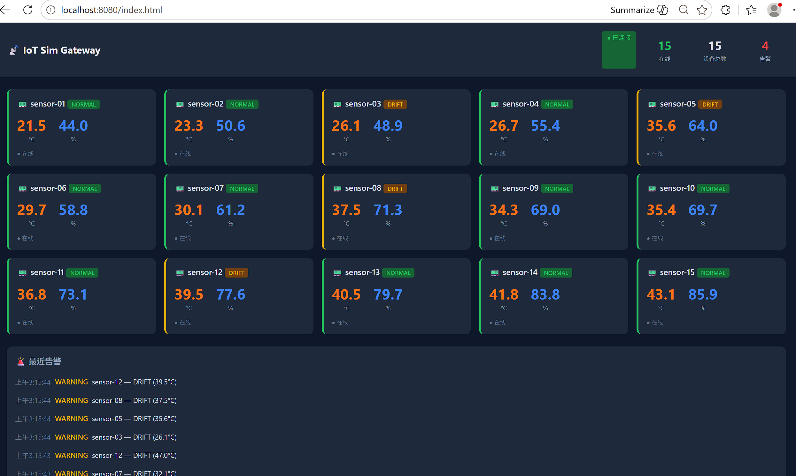

# 📡 iot-sim-gateway

> IoT 虚拟传感器仿真网关 — MQTT 数据仿真、异常注入、告警引擎、趋势预判、Web Dashboard。

[](https://python.org)
[]()
[](LICENSE)

---

## 架构

```
┌──────────────┐   MQTT    ┌──────────────┐   SSE    ┌──────────────┐
│  15 台虚拟   │ ────────► │   Mosquitto   │ ◄────── │  Dashboard   │
│  传感器      │  TCP:1883 │   Broker      │  HTTP   │  实时面板    │
└──────────────┘           └──────┬────────┘         └──────────────┘
                                  │
                          ┌───────▼────────┐
                          │    Gateway     │
                          │ ┌────────────┐ │
                          │ │ 告警引擎    │ │
                          │ │ 趋势预判    │ │
                          │ │ SQLite 存储 │ │
                          │ └────────────┘ │
                          └────────────────┘
```



## 快速开始

```bash
# 1. 安装依赖
pip install -r requirements.txt

# 2. 启动 Mosquitto（Windows 服务或手动）
#    mosquitto -c mosquitto.conf -v

# 3. 启动网关（终端 1）
python -m gateway.main

# 4. 启动仿真器（终端 2）
python -m simulator.main

# 5. 启动 Dashboard 桥接（终端 3）
cd dashboard && python server.py

# 6. 浏览器打开
# http://localhost:8080/index.html
```

## 仿真器开关

```bash
python cli/ctrl.py start              # 后台启动
python cli/ctrl.py stop               # 停止
python cli/ctrl.py status             # 查看状态
python cli/ctrl.py replay drift       # 回放：温度漂移
python cli/ctrl.py replay stuck       # 回放：传感器卡死
python cli/ctrl.py replay spike       # 回放：瞬时突刺
python cli/ctrl.py replay dropout     # 回放：传感器掉线
```

## 回放模式（面试推荐）

4 个预录异常场景，30 秒内必定触发告警，无需等待随机异常：

| 场景 | 模拟故障 | 触发效果 |
|------|---------|---------|
| `drift` | 传感器老化漂移 | 🔴 CRITICAL 高温告警 + 趋势预判倒计时 |
| `stuck` | 传感器卡死 | 🟡 数值冻结告警 |
| `spike` | 电磁干扰突刺 | 🟡 瞬时跳变告警 |
| `dropout` | 传感器掉线 | 🔴 离线告警 |

## CLI 查询

```bash
python cli/query.py stats                  # 整体统计
python cli/query.py device sensor-01       # 设备历史数据
python cli/query.py alerts --limit 10      # 最近告警
```

## 运行测试

```bash
python -m pytest tests/ -v
# 17 passed in 0.49s
```

## 配置

编辑 `config.yaml`：

| 配置项 | 说明 |
|--------|------|
| `simulator.device_count` | 虚拟设备数量 |
| `simulator.report_interval_sec` | 数据上报间隔 |
| `simulator.anomaly.*` | 异常触发概率 |
| `alerts.rules[*]` | 告警阈值、防抖次数、冷却时间、严重级别 |
| `feishu.webhook_url` | 飞书群机器人 Webhook（可选） |
| `deepseek.api_key` | DeepSeek API Key（可选，启用 AI 诊断） |

## 差异化

| 普通 Demo | 本项目 |
|-----------|--------|
| `random.uniform()` | 4 种异常工况状态机（DRIFT / STUCK / SPIKE / DROPOUT） |
| `if temp > 30: print()` | 防抖 + 冷却 + 分级 + 趋势预判（线性回归） |
| 终端输出 | SQLite 时序存储 + CLI 查询 |
| 看终端 | Web Dashboard 实时面板（SSE，零 CDN 依赖） |
| 赌随机 | 回放模式，30 秒确定性演示 |

## License

MIT
